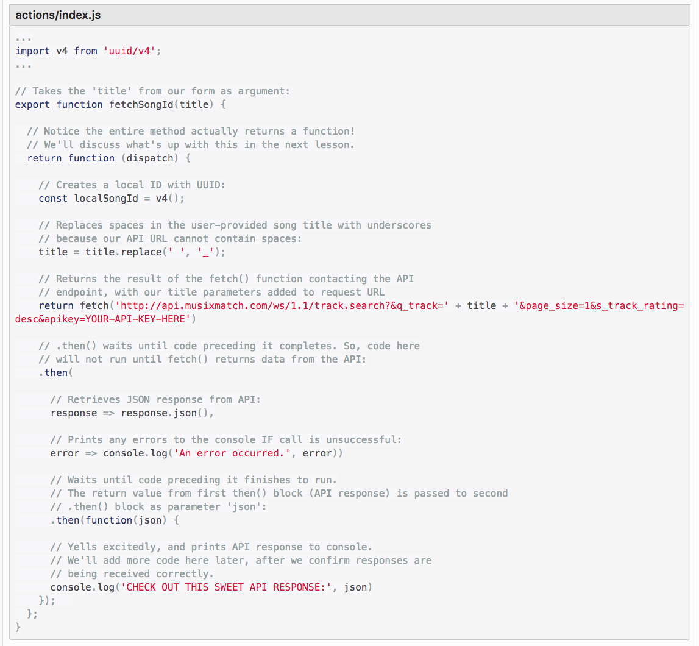

1. Create repositories, support and config files. Install atom packages for react.

```
git init
mkdir src
mkdir src/components
touch .gitignore template.ejs  webpack.config.js src/index.jsx src/components/App.jsx
npm init
apm i react@0.16.2
```
atom packages:
```
monokai theme 😎
language-babel
linter-eslint
```

.gitignore:
```
.DS_STORE
node_modules
build
```
2. Install webpack, React, ReactDOM, propTypes, babel transpiler, linter, webpack server, HMR, weback eslint loader, and style jsx.
```
npm install webpack@3.4.0 webpack-dev-server@2.5.0 eslint eslint-plugin-react -g   
```
```
npm install react@15.5.4 react-dom@15.5.4 react-router-dom prop-types@15.5.10  redux@3.7.2 react-redux@5.0.6 --save
```
```
npm install webpack@3.4.0 babel-core@6.24.1 babel-loader@7.0.0 babel-preset-es2015@6.24.1 babel-preset-react@6.24.1 webpack-dev-server@2.5.0 react-hot-loader@3.0.0-beta.7 html-webpack-plugin@2.29.0 eslint eslint-plugin-react eslint-loader  url-loader@0.6.2 file-loader@1.1.6 jest@20.0.4  babel-jest@20.0.3 --save-dev

```
```
npm install --save styled-jsx
npm install moment@2.18.1

```
when you add async actions:
```
$ npm install isomorphic-fetch@2.2.1 --save
$ npm install uuid@3.1.0 --save
```

3. Configure .eslintrc.json, template.ejs, webpack.config
 * Copy config files from practice repo
 * eslint --init (set up eslint config file)
 * webpack-dev-server
 * npm run start
 * npm run lint
 * npm run lint-fix

4. Set up index.jsx with hash router and HMR. Set up App component with Switch. Create Keg List component. Test routing between components.

5. Create data model component and iterate data into the view.

6. Wireframe style of components.

7. Refine style of components and resolve issues.

## Creating Stateful Components:

1. First we'll create a stateful class-based component that will record whether our app is in the state of displaying questions, or the state of displaying the form. We know this data must be state, not props, because it must be able to change.

2. Then we'll construct an event to toggle this state value when the user completes the questions.

3. After that we'll create a new component to contain the questions we want to appear before the form.

4. Next we'll learn how to use JSX conditional rendering to change what's displayed depending on the current state. That way our app can go from the state of displaying questions, to the state of displaying our form.

5. Finally, we'll learn about something called unidirectional data flow, a concept will allow our components to communicate and work in sync. (We'll also refactor the event we create in step 2.)

***** /*eslint-disable */    /*eslint-enable */   *****

## Testing with Jest
npm install jest@20.0.4 --save-dev
 npm install babel-jest@20.0.3 --save-dev
.babelrc
 ```
 {
  "env": {
    "development": {
        "plugins": ["transform-es2015-modules-commonjs"]
    },
    "test": {
        "plugins": ["transform-es2015-modules-commonjs"]
    }
  }
}
 ```
## Adding Redux to React

$ npm install redux@3.7.2 --save
$ npm install react-redux@5.0.6 --save

## Fetching from an api
Add fetch action to actions index:



Curried Function demo (use to create middleware)
```
var greetCurried = function(greeting) {
	return function(name) {
	console.log(greeting + ", " + name);
 };
};

var greetHello = greetCurried("hello");
var greetBye = greetCurried("auf weidersen");
greetHello("Tim");
greetBye("Heidi");
```
